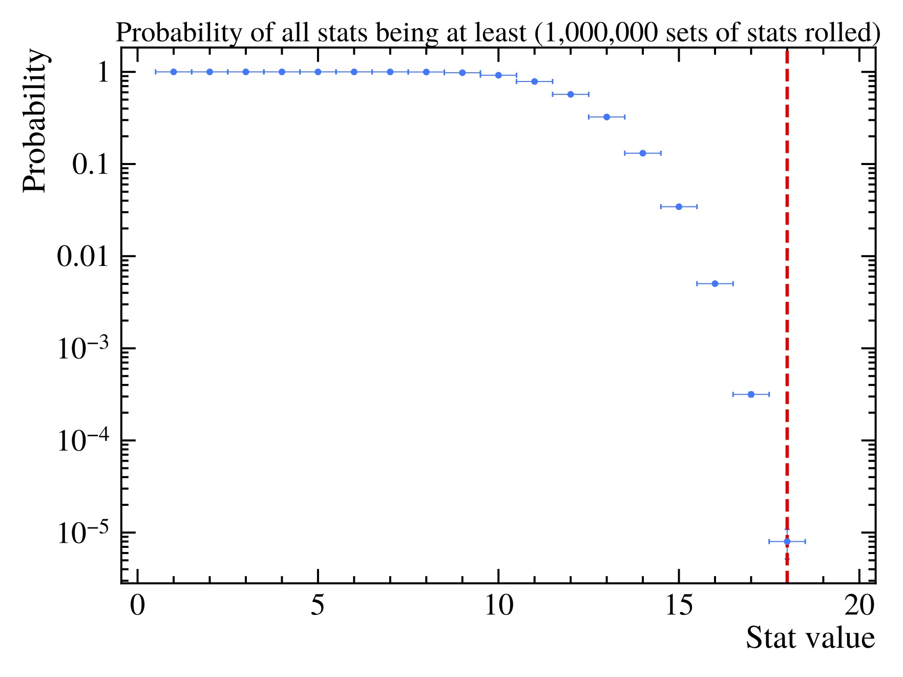

# Check Shelby's Friend's Rolls

Simple scripts to see the likelihood of getting stats like these:


According to Shelby,

> This guy rolled for this character and has been banned from rolling for his stats. Please note this is a level 8 character
> ...
> His girlfriend is the DM and swears that every dice was hand made by her verified balanced and he rolled in front of her

## Setup

Requires that Anaconda is installed.

From this directory, run:

```bash
conda env create
conda activate check_rolls
```

## Usage

From this directory (after setup), run:

```bash
python roll_dice.py 1000000 stats.root
python determine_probability.py stats.root probabilities.pdf
```

This will roll 1,000,000 sets of stats, show the results in `probabilities.pdf`, and print some values to the console.

For example, the output might look like this:

```text
Probability of all stats being at least:
1: (100.000000+/-0)%
2: (100.000000+/-0)%
3: (100.000000+/-0)%
4: (100.000000+/-0)%
5: (100.000000+/-0)%
6: (99.99980+/-0.00014)%
7: (99.9712+/-0.0017)%
8: (99.703+/-0.005)%
9: (97.934+/-0.014)%
10: (92.000+/-0.027)%
11: (78.67+/-0.04)%
12: (57.03+/-0.05)%
13: (32.40+/-0.05)%
14: (13.108+/-0.034)%
15: (3.441+/-0.018)%
16: (0.503+/-0.007)%
17: (0.0316+/-0.0018)%
18: (0.00080+/-0.00028)%
19: (0.000000+/-0)%
```


